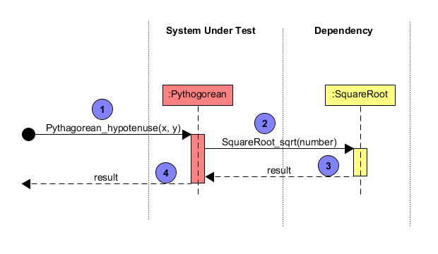

# CppUTest Example

This is an example about using [CppUTest](http://cpputest.github.io/)
to mock C files for unit test.


## Prerequisites

1. [CMake](https://cmake.org/)
2. GNU C/C++ compiler

## Directory Structure

```
cpputest_example
├── CMakeLists.txt           --> main cmake configuration file
├── LICENSE
├── readme.md
├── src                      --> pythagorean example
│   ├── CMakeLists.txt
│   ├── main.c
│   ├── pythagorean.c        --> unit under test
│   ├── pythagorean.h
│   ├── square_root.c        --> dependency of pythagorean.c
│   └── square_root.h
├── tests                    --> unit test against pythagorean.c
│   ├── CMakeLists.txt
│   └── pythagorean_ut       --> unit test using CppUTest and CppUMock
│       ├── CMakeLists.txt
│       ├── main.cpp
│       ├── pythagorean_ut.cpp
│       └── square_root_mock.cpp
└── testtools                --> unit test tools, will be built as libraries.
    ├── CMakeLists.txt
    ├── cpputest             --> cpputest library 
    └── cpputestext          --> cpputestext library which provides mocking support
```

## Unit Test

The `src` folder contains the source code of an example called `cpputest_example_pythagorean` after it is built by CMake.

* `pythagorean.c` implements a function called `Pythagorean_hypotenuse(x, y)`, which calculates the `hypotenuse` of a right-angled triangle with `x` and `y` as the two sides of right angle.
* `square_root.c` provides a function called `SquareRoot_sqrt(number)`, which returns the square root of the parameter `number`.
* The implementation of `Pythagorean_hypotenuse(x, y)` calls `SquareRoot_sqrt(number)`. That is, `Pythagorean_hypotenuse(x, y)` depends on `SquareRoot_sqrt(number)`.

We want to test `Pythagorean_hypotenuse(x, y)` function provided by `pythagorean.c`. From the unit test point of view, `Pythagorean_hypotenuse(x, y)` is the `System Under Test (SUT)`, `SquareRoot_sqrt(number)` is its dependency.



### Test 1 - Simple Test

```c
TEST(Pythagorean, simpleTest)
{
    // arrange
    mock().expectOneCall("SquareRoot_sqrt")
          .withParameter("number", 25.0)   // bubble 2 - expect the number is passed as 25.0.
                                           // because 4.0^2 + 5.0^2 is 25.0.
          .andReturnValue(5.0f);           // bubble 3 - return the result as 5.0f.
                                           // because square root of 25.0 is 5.0.

    // act
    float hypotenuse = Pythagorean_hypotenuse(3.0, 4.0); // bubble 3, 4

    // assert
    mock().checkExpectations();
    CHECK_EQUAL(5.0f, hypotenuse);
}
```

### Test 2 - Black Box Test

```C
TEST(Pythagorean, BlackBoxTest)
{
    // arrange
    mock().expectOneCall("SquareRoot_sqrt")
          .withParameter("number", 100.0)  // bubble 2 - expect the number is passed as 100.
                                           // because 6.0^2 + 8.0^2 is 100.0.
          .andReturnValue(100.0f);         // bubble 3 - intentionally set the result as 100.0 instead of 10.0.
                                           // we want to assure Pythagorean_hypotenuse(x, y) returns whatever SquareRoot_sqrt(number)` gives.

    // act
    float hypotenuse = Pythagorean_hypotenuse(6.0, 8.0); // bubble 3, 4

    // assert
    mock().checkExpectations();
    CHECK_EQUAL(100.0f, hypotenuse);
}
```

### Building the example on Linux

```
~/cpputest_example (master)$ cmake -B build -G "Unix Makefiles"
-- The C compiler identification is GNU 7.5.0
-- The CXX compiler identification is GNU 7.5.0
-- Check for working C compiler: /usr/bin/cc
-- Check for working C compiler: /usr/bin/cc -- works
-- Detecting C compiler ABI info
-- Detecting C compiler ABI info - done
-- Detecting C compile features
-- Detecting C compile features - done
-- Check for working CXX compiler: /usr/bin/c++
-- Check for working CXX compiler: /usr/bin/c++ -- works
-- Detecting CXX compiler ABI info
-- Detecting CXX compiler ABI info - done
-- Detecting CXX compile features
-- Detecting CXX compile features - done
-- Configuring done
-- Generating done
-- Build files have been written to: /home/max/cpputest_example/build
~/cpputest_example (master)$ ls
CMakeLists.txt  LICENSE  build  readme.md  src  tests  testtools
max@p50:~/cpputest_example (master)$ cd build
max@p50:~/cpputest_example/build (master)$ make
Scanning dependencies of target CppUTest
[  2%] Building CXX object testtools/cpputest/CMakeFiles/CppUTest.dir/CommandLineArguments.cpp.o
...
...
...
[ 93%] Building C object src/CMakeFiles/cpputest_example_pythagorean.dir/main.c.o
[ 95%] Building C object src/CMakeFiles/cpputest_example_pythagorean.dir/pythagorean.c.o
[ 97%] Building C object src/CMakeFiles/cpputest_example_pythagorean.dir/square_root.c.o
[100%] Linking C executable cpputest_example_pythagorean
[100%] Built target cpputest_example_pythagorean
```

### Test Result

```text
~/cpputest_example/build $ ctest -V
...
test 1
    Start 1: pythagorean_test

1: Test command:
~/cpputest_example/code-build/tests/pythagorean_ut/pythagorean_ut.exe
1: Test timeout computed to be: 1500
1: 
1: SquareRoot_sqrt gets called with parameter: 100.000000.
1: .
1: SquareRoot_sqrt gets called with parameter: 25.000000.
1: .
1: OK (2 tests, 2 ran, 6 checks, 0 ignored, 0 filtered out, 0 ms)
1:
1/1 Test #1: pythagorean_test .................   Passed    0.09 sec

100% tests passed, 0 tests failed out of 1

Total Test time (real) =   0.15 sec
```

## References

1. [CppUTest](http://cpputest.github.io/manual.html)
2. [CppUMock](http://cpputest.github.io/mocking_manual.html)
3. [CMake Tutorial - JohnLamp.netJohnLamp.net](https://www.johnlamp.net/cmake-tutorial.html)
4. [CMake Tutorial | CMake](https://cmake.org/cmake-tutorial/)
5. [Introduction to CMake by Example | derekmolloy.ie](http://derekmolloy.ie/hello-world-introductions-to-cmake/)

[](https://travis-ci.org/maxpeng/cpputest_example)
